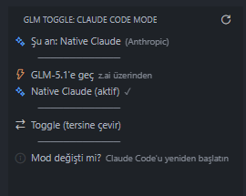

# GLM Toggle for Claude Code

> Switch between **GLM-5.1 (z.ai)** and **native Claude** in [Claude Code](https://claude.com/claude-code) with one click — right from VS Code's activity bar.



If you use Claude Code with [z.ai's GLM-5.1](https://z.ai) as a backend (for cost or availability reasons), but sometimes want to switch back to Anthropic's native Claude, this extension makes that toggle painless.

No more editing `~/.claude/settings.json` by hand or remembering which env vars to comment out.

---

## Features

- **One-click toggle** between GLM-5.1 (via z.ai) and native Claude (Anthropic API)
- **Activity bar icon** with a dedicated panel — never forget where the toggle is
- **Status bar indicator** showing the current mode at a glance (`⚡ GLM-5.1` / `✨ Claude`)
- **Color-coded** — yellow background when GLM is active, default when native Claude
- **External change detection** — if you edit `settings.json` manually, the UI updates automatically
- **Optional CLI** — bundled `glm.bat` lets you toggle from any terminal (`glm on`, `glm off`, `glm status`)

## How it works

Claude Code reads its configuration from `~/.claude/settings.json`. To use GLM via z.ai, you need a block like:

```json
{
  "env": {
    "ANTHROPIC_BASE_URL": "https://api.z.ai/api/anthropic",
    "ANTHROPIC_AUTH_TOKEN": "your-z-ai-token",
    "ANTHROPIC_DEFAULT_SONNET_MODEL": "glm-5.1",
    "ANTHROPIC_DEFAULT_OPUS_MODEL": "glm-5.1",
    "ANTHROPIC_DEFAULT_HAIKU_MODEL": "glm-4.5-air"
  }
}
```

GLM Toggle keeps **two profile files** — one with the z.ai env block (GLM mode), one without it (native Claude mode) — and swaps them into `settings.json` when you click a button.

```
~/.claude/
├── settings.json          ← active config (overwritten on toggle)
└── profiles/
    ├── glm.json           ← your GLM-5.1 config
    └── claude.json        ← your native Claude config
```

> Claude Code only reads env vars at startup. **Restart Claude Code after toggling** for the change to take effect. The extension shows a reminder notification.

## Installation

### Prerequisites

- VS Code 1.70+
- [Claude Code](https://claude.com/claude-code) installed
- (Optional) A z.ai account and API token if you want to use GLM-5.1

### 1. Set up your profile files

Create the profile folder and copy the examples:

```bash
mkdir -p ~/.claude/profiles
cp profiles/glm.json.example ~/.claude/profiles/glm.json
cp profiles/claude.json.example ~/.claude/profiles/claude.json
```

Then edit `~/.claude/profiles/glm.json` and replace `YOUR_Z_AI_TOKEN_HERE` with your actual z.ai API token.

> ⚠️ **Never commit `~/.claude/profiles/glm.json` to version control** — it contains your API token. The repo's `.gitignore` should already exclude `.claude/`, but double-check.

### 2. Install the VS Code extension

**Option A — install from .vsix (recommended for most users):**

Download the latest `glm-toggle-X.Y.Z.vsix` from [Releases](../../releases) and install it:

```bash
code --install-extension glm-toggle-0.1.0.vsix
```

Or in VS Code: open the Extensions panel (`Ctrl+Shift+X`) → click the `...` menu → "Install from VSIX..." → pick the file.

**Option B — build from source:**

```bash
git clone https://github.com/system-conf/claude-code-glm-toggle.git
cd glm5-vscode-toogle
powershell -ExecutionPolicy Bypass -File scripts/build-vsix.ps1
code --install-extension glm-toggle-0.1.0.vsix
```

After installing, **reload VS Code** (`Ctrl+Shift+P` → "Developer: Reload Window").

## Usage

After installing, you'll see:

- A **toggle-switch icon** in the left activity bar
- A **mode indicator** in the bottom-right status bar (`⚡ GLM-5.1` or `✨ Claude`)

**To switch modes:**
- Click the activity bar icon → click the desired mode in the panel
- Or click the status bar item (toggles between the two modes)
- Or run a command: `Ctrl+Shift+P` → `GLM Toggle: ...`

**After every switch, restart Claude Code** so the new env vars are picked up.

## Optional: command-line toggle

If you want to switch modes from a terminal (without opening VS Code), copy `scripts/glm.bat` to a folder on your PATH:

```bash
cp scripts/glm.bat ~/.claude/
# add ~/.claude to your PATH
powershell -ExecutionPolicy Bypass -File scripts/add-to-path.ps1
```

Then from any terminal:

```
glm status     # show current mode
glm on         # switch to GLM-5.1
glm off        # switch to native Claude
glm            # toggle
```

## Configuration

| Setting | Default | Description |
|---|---|---|
| `glmToggle.claudeDir` | `""` (uses `~/.claude`) | Custom path to your `.claude` directory. Useful if you keep configs in a non-standard location. |

## Project layout

```
glm5-vscode-toogle/
├── extension.js              # VS Code extension entry point
├── package.json              # Extension manifest
├── icon.svg                  # Activity bar icon
├── profiles/                 # Template profile files (no secrets)
│   ├── glm.json.example
│   └── claude.json.example
├── scripts/                  # Helper scripts
│   ├── glm.bat               # CLI toggle (Windows)
│   ├── add-to-path.ps1       # Add ~/.claude to user PATH
│   └── build-vsix.ps1        # Build .vsix package
└── docs/
    └── screenshots/
```

## Contributing

PRs welcome — especially:

- **macOS / Linux shell scripts** (currently Windows-only for the CLI piece; the extension itself is cross-platform)
- **Custom profile names** beyond just `glm` / `claude` (e.g. support `gpt`, `gemini`, multiple z.ai accounts)
- **Better activity bar icon**
- **Screenshots** for the README

## Security

- Your API token lives in `~/.claude/profiles/glm.json`. The extension never sends it anywhere — it just copies the file into `settings.json` when you toggle.
- The extension reads `settings.json` to detect the current mode (by looking for `api.z.ai` in the content). It writes only when you explicitly trigger a toggle command.
- **Rotate your z.ai token if you ever accidentally commit it.**

## License

MIT — see [LICENSE](LICENSE).

## Acknowledgements

Built because manually swapping `settings.json` blocks every time you want to A/B between GLM and Claude gets old fast.

Not affiliated with Anthropic or z.ai.
